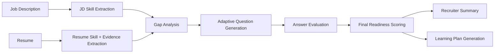

# AI-Powered Skill Assessment & Personalised Learning Plan Agent

An intelligent assessment agent that goes beyond resume keyword matching. This project takes a Job Description and a candidate resume, evaluates actual skill proficiency through adaptive technical questioning, identifies skill gaps, and generates a personalised learning plan with curated resources and time estimates.

## Problem Statement

A resume tells you what someone claims to know, but not how well they actually know it. This project solves that by combining:

- Job Description skill extraction
- Resume evidence extraction
- Conversational skill assessment
- Gap identification
- Personalised learning plan generation

The system is designed to help recruiters, hiring teams, and candidates better understand role readiness and realistic upskilling paths.

## Features

- Extracts required skills from a Job Description
- Extracts claimed skills and evidence from a resume
- Compares role requirements against resume-backed experience
- Generates adaptive technical interview questions for each skill
- Scores answers based on technical accuracy, depth, and clarity
- Produces per-skill readiness levels:
  - `ready`
  - `near_ready`
  - `gap`
- Generates a recruiter-style summary
- Builds a personalised learning plan using adjacent skills, curated resources, and weekly effort estimates

## Example Workflow

1. Paste a Job Description
2. Paste a candidate resume
3. Extract required and claimed skills
4. Build a skill gap analysis
5. Ask technical follow-up questions skill by skill
6. Score candidate responses
7. Generate:
   - overall readiness score
   - hiring recommendation
   - strengths and concerns
   - personalised learning plan

## Tech Stack

### Backend
- FastAPI
- Pydantic
- Groq API
- Python

### Frontend
- Streamlit
- Pandas
- Requests

## Project Structure

```text
ai-skill-agent/
│
├── backend/
│   ├── app.py
│   ├── logic.py
│   ├── llm.py
│   ├── prompts.py
│   ├── models.py
│   ├── data.py
│   ├── requirements.txt
│   └── .env
│
├── frontend/
│   ├── app.py
│   └── requirements.txt
│
├── sample_data/
│   ├── jd_ai_engineer.txt
│   ├── resume_strong.txt
│   ├── resume_mid.txt
│   ├── resume_beginner.txt
│   └── sample_output.json
│
├── docs/
│   └── architecture.md
│
├── .gitignore
└── README.md

```

## Architecture

The system follows a multi-stage pipeline:



## Core Logic

1. Skill Extraction

The agent extracts:

- required skills from the Job Description
- claimed skills from the resume
- supporting evidence from resume text

2. Gap Analysis

For each required skill, the system compares:

- expected skill level from JD
- claimed skill level from resume
- evidence strength
- confidence score
- This produces a per-skill gap score.

3. Conversational Assessment

The system generates adaptive technical questions for each important skill:

- conceptual questions
- practical questions

The question depth depends on:

- skill importance
- resume evidence
- gap score

4. Answer Scoring

Each answer is scored on:

- technical accuracy
- depth
- clarity

These are combined with resume evidence to produce a final skill score.

5. Final Skill Status

Each skill is classified as:

- ready
- near_ready
- gap

6. Learning Plan

For weak or missing skills, the system generates:

- why the skill matters
- adjacent skills
- recommended learning path
- weekly learning plan
- curated resources
- estimated time per week and duration

## Scoring Logic

The final skill score combines:

- resume evidence score
- answer quality score
- confidence score

Special handling is included for:

- strong answer but weak resume evidence
- strong resume evidence but no answer captured

This avoids unfairly penalising candidates for incomplete evidence in one channel.

## Setup Instructions

1. Clone the repository

```powershell
git clone <your-repo-url>
cd ai-skill-agent
```

2. Backend setup

```powershell
cd backend
python -m venv venv
venv\Scripts\activate
pip install -r requirements.txt
```

Create a .env file in backend/:

```powershell
GROQ_API_KEY=your_groq_api_key_here
GROQ_MODEL=llama-3.3-70b-versatile
```

If llama-3.3-70b-versatile is unavailable, use:

```powershell
GROQ_MODEL=llama-3.1-8b-instant
```

Run the backend:

```powershell
uvicorn app:app --reload
```

Backend runs at:

```text
http://127.0.0.1:8000
```

3. Frontend setup

Open a new terminal:

```powershell
cd frontend
python -m venv venv
venv\Scripts\activate
pip install -r requirements.txt
$env:API_BASE_URL="http://127.0.0.1:8000"
streamlit run app.py
```

Frontend usually runs at:

```text
http://localhost:8501
```

## Sample Inputs

### Sample Job Description

See:

- sample_data/jd_ai_engineer.txt

### Sample Resumes

See:

- sample_data/resume_strong.txt
- sample_data/resume_mid.txt
- sample_data/resume_beginner.txt

### Sample Output

See:

- sample_data/sample_output.json

A typical output contains:

- extracted skills
- gap analysis
- per-skill scores
- hiring recommendation
- personalised learning plan

## Example Use Case

For an AI Engineer role requiring:

- Python
- SQL
- FastAPI
- Machine Learning
- MLOps

The system may find that the candidate is:

- strong in Python and FastAPI
- near-ready in Machine Learning and MLOps
- weaker in SQL
- needing targeted upskilling in LLM workflows

It then creates a structured plan with resources and time estimates.

## Why This Project Is Useful

Traditional resume screening often overestimates candidate readiness because it relies on stated skills. This project improves the process by:

- validating skill claims through targeted questioning
- grounding assessment in both evidence and responses
- providing constructive next steps instead of only rejection

It can be useful for:

- hiring teams
- technical recruiters
- bootcamps
- candidate self-assessment tools
- internal learning and development workflows

## Limitations

- LLM outputs may vary depending on model behavior
- Resume evidence extraction depends on input quality
- Current scoring is heuristic-guided and not trained on a labeled assessment dataset
- The system is designed as a prototype and can be improved further with retrieval, benchmarking
and broader skill ontologies

## Future Improvements

- Deploy as a hosted web app
- Add authentication and candidate session history
- Support PDF resume upload and parsing
- Add richer recruiter analytics dashboard
- Improve question difficulty calibration
- Add benchmarking against labeled assessment data
- Expand curated resource library by domain
- Add human-in-the-loop recruiter review mode

## Demo Checklist

This submission includes:

- working prototype
- source code
- README
- architecture description
- sample inputs
- sample outputs

## Author

Built for the Catalyst hackathon problem statement:

AI-Powered Skill Assessment & Personalised Learning Plan Agent

```md
git clone https://github.com/madhura276/ai-skill-assessment-agent
