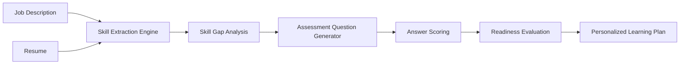
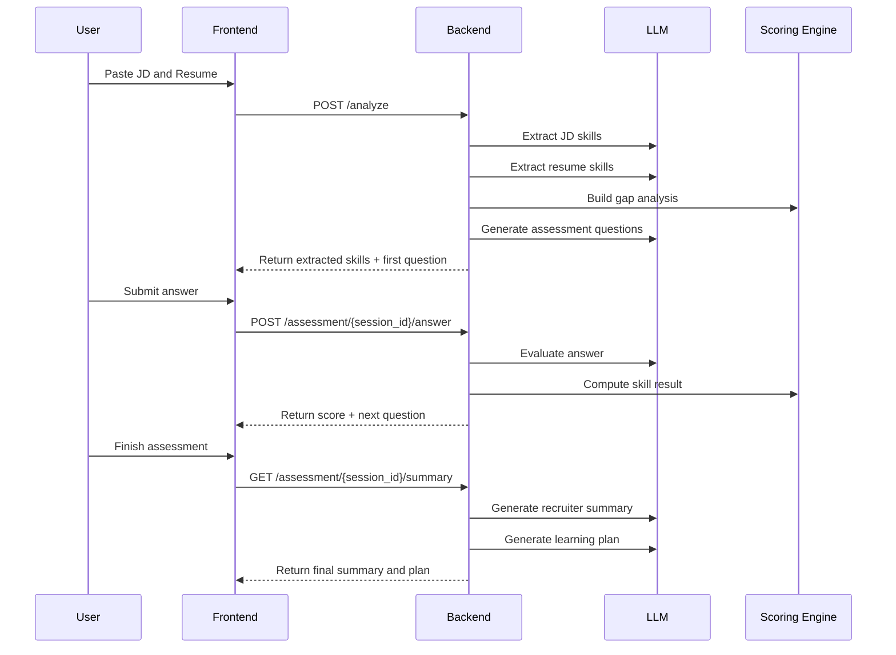

# Architecture

# System Components

### 1. Job Description Skill Extraction

The system parses the Job Description and extracts:

- required technical skills
- expected proficiency level
- skill importance:
    - critical
    - important
    - optional

Example:

- Python -> critical, advanced
- SQL -> critical, advanced
- NLP -> optional, intermediate

### 2. Resume Skill and Evidence Extraction

The system analyzes the candidate resume and extracts:

- claimed skills
- claimed proficiency level
- supporting evidence from the resume text
- confidence score

Example evidence:

- "hands-on experience in Python"
- "Built internal tools using pandas"
- "Limited production experience with MLOps"

### 3. Skill Gap Analysis

The extracted Job Description skills are compared with the extracted resume skills.

For each required skill, the system computes:

- expected level
- claimed level
- resume evidence score
- gap score

This helps identify:

- strong matches
- near matches
- missing or weak areas

### 4. Adaptive Question Generator

The system creates technical follow-up questions for each important skill.

The question generation adapts based on:

- how important the skill is in the JD
- how strongly the resume supports the skill
- the estimated gap between required and claimed proficiency

Question types include:

- conceptual
- practical

Examples:

- SQL conceptual question
- FastAPI practical implementation question
- MLOps deployment or monitoring question

### 5. Answer Evaluation Engine

Candidate answers are evaluated using an LLM-assisted scoring layer.

Each answer is scored across:

- technical accuracy
- depth
- clarity

This produces an answer-level score that reflects whether the candidate can actually explain or apply the skill.

### 6. Final Readiness Scoring

Each skill receives a final score using a combination of:

- resume evidence score
- answer score
- consistency/confidence score

The final skill status is classified as:

- ready
- near_ready
- gap

Special handling is included for:

- strong answers with weak resume evidence
- strong resume evidence without direct assessment answers

This avoids unfairly penalizing candidates based on only one signal.

### 7. Recruiter Summary

The system produces a recruiter-style summary containing:

- overall readiness score
- hiring recommendation
- strengths
- concerns

Recommendation labels include:

- Strong Match
- Promising, Needs Upskilling
- Not Yet Ready

### 8. Personalised Learning Plan

For weak or missing skills, the system generates a structured learning roadmap including:

- why the skill matters
- adjacent skills the candidate can realistically acquire
- curated resources
- weekly milestones
- time estimates

Example:

- MLOps -> Docker, monitoring, deployment
- SQL -> data modeling, query optimization
- LLM -> transformers, prompt engineering, deployment basics

### 9. Frontend

The Streamlit frontend provides:

- Job Description and resume input
- extracted skills view
- gap analysis display
- conversational assessment flow
- answer evaluation feedback
- final hiring summary
- learning plan visualization

# Scoring Logic

The final skill score is computed using multiple signals:

1. Resume Evidence Score

   - based on claimed level
   - strengthened by evidence phrases
   - adjusted with confidence

2. Answer Score

   - based on technical accuracy
   - depth
   - clarity

3. Confidence Score

   - based on consistency between resume evidence and answer quality

# Skill Status Thresholds

- 0.80+ -> ready
- 0.60 to 0.79 -> near_ready
- <0.60 -> gap

# Special Cases

- If resume evidence is weak but answer quality is strong, answer score gets higher weight
- If resume evidence is strong but no answer is captured, resume signal is preserved using fallback scoring

# Data Flow

# Design Rationale

This architecture was chosen to balance:

- practical implementation speed
- explainability
- strong demo value
- realistic hiring use case alignment

# Why this design works

- Resume screening alone is not enough
- Pure LLM assessment without structure is hard to trust
- Pure rule-based matching feels shallow

This design combines:

- LLM reasoning for extraction, evaluation, and planning
- deterministic scoring structure for consistency
- curated logic for better explainability

# Current Limitations

- LLM outputs may vary by model quality
- Skill extraction depends on resume phrasing
- Scoring is heuristic-guided rather than benchmark-trained
- The system currently works on pasted text rather than uploaded PDF parsing

# Future Improvements

- PDF resume upload and parsing
- richer multi-turn adaptive interviews
- recruiter dashboard and candidate comparison
- domain-specific skill ontologies
- evaluation on labeled hiring datasets
- deployment as a public web application

# Summary

This architecture supports the full problem statement by providing an end-to-end system that:

- understands the role requirements
- understands the candidate’s stated experience
- tests actual proficiency through targeted questions
- detects real gaps
- produces actionable learning guidance

It turns resume screening into a more evidence-based and personalised assessment workflow.